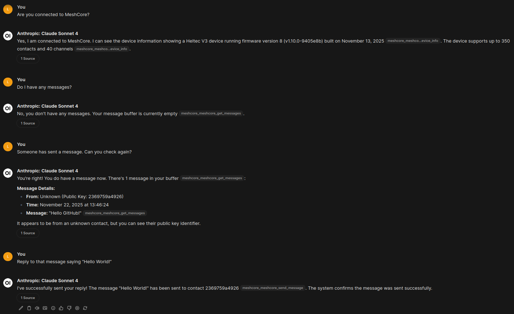

# MeshCore MCP Server

An MCP (Model Context Protocol) server that provides tools for interacting with MeshCore companion radio nodes via HTTP. This enables AI assistants and web-based tools to control and communicate with mesh network devices.



The image above shows an example of how the OpenWebUI conversation interface appears during interaction.

## Features

**Core Tools:**
- `meshcore_connect` - Connect to devices via Serial, BLE, or TCP
- `meshcore_disconnect` - Cleanly disconnect from devices
- `meshcore_send_message` - Send messages to contacts or channels
- `meshcore_send_advert` - Send advertisements to announce device presence
- `meshcore_get_contacts` - List all contacts
- `meshcore_get_device_info` - Query device information
- `meshcore_get_battery` - Check battery status

**Clock Management Tools:**
- `meshcore_get_time` - Get current device time
- `meshcore_set_time` - Set device time to specific Unix timestamp
- `meshcore_sync_clock` - Sync device clock to system time

**Message Listening Tools:**
- `meshcore_start_message_listening` - Start receiving incoming messages
- `meshcore_stop_message_listening` - Stop receiving messages
- `meshcore_get_messages` - Retrieve received messages from buffer
- `meshcore_clear_messages` - Clear message buffer

**Transport:**
- HTTP with Streamable transport (MCP protocol 2025-03-26)
- Web-accessible for browser clients and agents
- Configurable host/port binding

## Quick Start with Docker (Recommended)

The easiest way to run MeshCore MCP Server is using our official Docker image:

```bash
# Basic usage (port 8000)
docker run -d \
  --name meshcore-mcp \
  -p 8000:8000 \
  ghcr.io/ipnet-mesh/meshcore-mcp:main

# With serial device access (Linux)
docker run -d \
  --name meshcore-mcp \
  -p 8000:8000 \
  --device=/dev/ttyUSB0 \
  ghcr.io/ipnet-mesh/meshcore-mcp:main \
  --serial-port /dev/ttyUSB0 --baud-rate 115200

# With auto-connect and clock sync (recommended)
docker run -d \
  --name meshcore-mcp \
  -p 8000:8000 \
  --device=/dev/ttyUSB0 \
  ghcr.io/ipnet-mesh/meshcore-mcp:main \
  --serial-port /dev/ttyUSB0 --sync-clock-on-startup

# Custom port
docker run -d \
  --name meshcore-mcp \
  -p 3000:8000 \
  ghcr.io/ipnet-mesh/meshcore-mcp:main
```

**Available tags:**
- `main` - Latest development build
- `latest` - Latest stable release
- `vX.Y.Z` - Specific version tags

**Docker Compose example:**

```yaml
version: '3.8'
services:
  meshcore-mcp:
    image: ghcr.io/ipnet-mesh/meshcore-mcp:main
    ports:
      - "8000:8000"
    devices:
      - /dev/ttyUSB0:/dev/ttyUSB0
    command: ["--serial-port", "/dev/ttyUSB0", "--sync-clock-on-startup"]
    restart: unless-stopped
```

## Installation from Source

### Prerequisites
- Python 3.10 or higher
- A MeshCore-compatible device (connected via Serial/BLE/TCP)

### Install from source

```bash
# Clone the repository
git clone https://github.com/ipnet-mesh/meshcore-mcp.git
cd meshcore-mcp

# Create and activate virtual environment
python3 -m venv .venv
source .venv/bin/activate  # Linux/macOS
# OR
.venv\Scripts\activate     # Windows

# Install dependencies
pip install -e .
```

## Usage

### Starting the HTTP Server

**With Docker (recommended):**
See [Quick Start with Docker](#quick-start-with-docker-recommended) section above.

**With Python (local development):**

**Default (localhost:8000):**
```bash
python -m meshcore_mcp.server
```

**Custom host/port:**
```bash
python -m meshcore_mcp.server --host 0.0.0.0 --port 3000
```

**With auto-connect to serial device (recommended):**
```bash
python -m meshcore_mcp.server --serial-port /dev/ttyUSB0 --baud-rate 115200
```

This will connect to the device on startup and fail-fast if the connection fails. Debug mode can be enabled with `--debug`.

**With auto-connect and clock sync (recommended for accurate timestamps):**
```bash
python -m meshcore_mcp.server --serial-port /dev/ttyUSB0 --sync-clock-on-startup
```

This will connect to the device on startup and automatically synchronize the device clock to the system time, ensuring accurate message timestamps.

**As an installed command:**
```bash
meshcore-mcp --serial-port /dev/ttyUSB0 --debug
```

The server will print:
```
Starting MeshCore MCP Server on 0.0.0.0:8000
Server URL: http://0.0.0.0:8000
[STARTUP] Auto-connect enabled for /dev/ttyUSB0
[STARTUP] Server starting, connecting to device...
[STARTUP] Attempting to connect to /dev/ttyUSB0 at 115200 baud...
[STARTUP] Successfully connected to MeshCore device on /dev/ttyUSB0
[STARTUP] Syncing device clock to system time...
[STARTUP] Clock synced successfully to 2025-11-22 14:30:00
[STARTUP] Device connected. Starting message listening...
[STARTUP] Subscribed to contact messages
[STARTUP] Subscribed to channel messages
[STARTUP] Subscribed to advertisements
[STARTUP] Auto message fetching started
[STARTUP] Message listening active with 3 subscriptions
[STARTUP] Server ready.
```

(Clock sync messages only appear when using `--sync-clock-on-startup`)

The server automatically subscribes to incoming messages and advertisements, so it's ready to receive and buffer messages immediately.

### With Claude Desktop

Add this configuration to your Claude Desktop config file:

**macOS**: `~/Library/Application Support/Claude/claude_desktop_config.json`
**Windows**: `%APPDATA%\Claude\claude_desktop_config.json`
**Linux**: `~/.config/Claude/claude_desktop_config.json`

```json
{
  "mcpServers": {
    "meshcore": {
      "url": "http://localhost:8000"
    }
  }
}
```

For remote servers:
```json
{
  "mcpServers": {
    "meshcore": {
      "url": "http://your-server-ip:8000"
    }
  }
}
```

### With OpenWebUI

OpenWebUI uses [MCPO](https://github.com/open-webui/mcpo) (MCP-to-OpenAPI proxy) to connect to MCP servers. Configure MCPO with:

**1. Create a `config.json` file:**

```json
{
  "mcpServers": {
    "meshcore": {
      "type": "streamable-http",
      "url": "http://localhost:8000/mcp"
    }
  }
}
```

_See `examples/mcpo_config.json` for a complete example._

For remote servers:
```json
{
  "mcpServers": {
    "meshcore": {
      "type": "streamable-http",
      "url": "http://your-server-ip:8000/mcp"
    }
  }
}
```

**2. Run MCPO with Docker:**

```bash
# Note: MCPO runs on port 8080 to avoid conflict with the MCP server on 8000
docker run -d \
  --name mcpo \
  -p 8080:8000 \
  -v $(pwd)/config.json:/app/config/config.json \
  ghcr.io/open-webui/mcpo:main
```

**Important:** The MCP server runs on port 8000, while MCPO is exposed on port 8080 to avoid conflicts. Adjust ports as needed for your environment.

**3. Configure OpenWebUI:**

In OpenWebUI settings, add the MCPO endpoint as an OpenAPI server. The tools will then be available to your AI models.

**See also:** [OpenWebUI MCP Documentation](https://docs.openwebui.com/features/mcp/) and [MCPO GitHub](https://github.com/open-webui/mcpo)

### With Other MCP Clients

The HTTP server is compatible with any MCP client that supports the Streamable HTTP transport (MCP protocol 2025-03-26).

**Server endpoint:** `http://localhost:8000/mcp`

**Note:** The MCP endpoint requires proper MCP protocol handshaking with session management. Use an MCP-compatible client library (like the official MCP SDK) or a proxy like MCPO for integration with non-MCP tools.

## Tool Examples

### Connecting to a Device

**Serial Connection:**
```json
{
  "type": "serial",
  "port": "/dev/ttyUSB0",
  "baud_rate": 115200,
  "debug": true
}
```

**BLE Connection:**
```json
{
  "type": "ble",
  "address": "12:34:56:78:90:AB",
  "pin": "123456"
}
```

**TCP Connection:**
```json
{
  "type": "tcp",
  "host": "192.168.1.100",
  "port": "4000",
  "auto_reconnect": true
}
```

### Sending a Message

```json
{
  "destination": "Alice",
  "text": "Hello from MCP!"
}
```

### Sending an Advertisement

**Zero-hop advertisement (immediate neighbors only):**
```json
{
  "flood": false
}
```

**Flooded advertisement (multi-hop via repeaters):**
```json
{
  "flood": true
}
```

Advertisements announce your device's presence to the mesh network. Use `flood: false` for zero-hop broadcasts to immediate neighbors, or `flood: true` for multi-hop broadcasts that are repeated by all network repeaters.

### Getting Contacts

Call `meshcore_get_contacts` with no parameters to retrieve your contact list.

### Querying Device Info

Call `meshcore_get_device_info` to get device name, version, and configuration details.

### Checking Battery

Call `meshcore_get_battery` to get current battery level and status.

### Managing Device Clock

**Get device time:**
```json
{}
```
Call `meshcore_get_time` to retrieve the current time from the device.

**Sync clock to system time:**
```json
{}
```
Call `meshcore_sync_clock` to synchronize the device clock with the current system time. This is the easiest way to ensure accurate timestamps.

**Set specific time:**
```json
{
  "timestamp": 1732276800
}
```
Call `meshcore_set_time` to set the device clock to a specific Unix timestamp (seconds since epoch).

### Listening for Messages

**Start listening:**
```json
{}
```
Call `meshcore_start_message_listening` to start receiving messages. Messages are stored in a buffer (up to 1000 messages).

**Get received messages:**
```json
{
  "limit": 10,
  "message_type": "contact"
}
```
- `limit`: Optional, number of most recent messages to retrieve
- `message_type`: Optional, filter by "contact" or "channel"
- `clear_after_read`: Optional, set to `true` to clear messages after reading

**Stop listening:**
```json
{}
```
Call `meshcore_stop_message_listening` to stop receiving new messages (buffer is retained).

**Clear message buffer:**
```json
{}
```
Call `meshcore_clear_messages` to empty the message buffer.

## Example Conversation with Claude

```
You: Connect to my MeshCore device on /dev/ttyUSB0

Claude: I'll connect to your MeshCore device.
[Uses meshcore_connect tool]
Successfully connected to MeshCore device via serial

You: What's my battery level?

Claude: Let me check your battery status.
[Uses meshcore_get_battery tool]
Battery Level: 85%

You: Sync the device clock

Claude: I'll synchronize the device clock with the current system time.
[Uses meshcore_sync_clock tool]
Device clock synchronized successfully!
  System Time: 2025-11-22 14:30:00
  Unix Timestamp: 1732285800

You: Send a message to Bob saying "Meeting at 3pm"

Claude: I'll send that message to Bob.
[Uses meshcore_send_message tool]
Message sent to Bob: "Meeting at 3pm"
Result: MSG_SENT

You: Start listening for messages

Claude: I'll start listening for incoming messages.
[Uses meshcore_start_message_listening tool]
Started listening for messages. Messages will be buffered and can be retrieved with meshcore_get_messages.

You: Check if I have any messages

Claude: Let me check your messages.
[Uses meshcore_get_messages tool]
Messages (2 total):
============================================================

[1] CONTACT MESSAGE
  Time: 2025-11-21T10:30:15
  From: Alice
  Public Key: a1b2c3
  Message: Got it, see you at 3!
------------------------------------------------------------

[2] CHANNEL MESSAGE
  Time: 2025-11-21T10:32:00
  From: Bob
  Public Key: d4e5f6
  Channel: 0
  Message: Weather looks good today
------------------------------------------------------------
```

The "Public Key" field is the sender's address and should be used as the destination when replying with meshcore_send_message.

## Architecture

The server uses **FastMCP** with **Streamable HTTP transport** for web accessibility. Connection state is managed globally, and all tools validate connectivity before executing commands.

**Key Components:**
- **HTTP Server**: FastMCP with streamable-http transport (MCP 2025-03-26)
- **Server State**: Global `ServerState` class maintains connection instance and message buffer
- **Message Buffer**: Stores up to 1000 received messages with automatic overflow handling
- **Event Subscriptions**: Real-time message handling via meshcore event system
- **Tool Decorators**: Each tool uses `@mcp.tool()` for automatic registration
- **Error Handling**: All commands check for EventType.ERROR responses
- **Connection Types**: Supports Serial, BLE, and TCP with appropriate validation

**Why HTTP?**
- **Web Accessible**: Compatible with browser-based clients and agents
- **Stateless Options**: Can be scaled horizontally if needed
- **Remote Access**: Connect from anywhere on the network
- **Standard Protocol**: Uses MCP Streamable HTTP (latest standard)

## Development

### Building the Docker Image

```bash
# Build locally
docker build -t meshcore-mcp:local .

# Run your local build
docker run -p 8000:8000 meshcore-mcp:local

# With device access
docker run -p 8000:8000 --device=/dev/ttyUSB0 meshcore-mcp:local \
  --serial-port /dev/ttyUSB0
```

### Project Structure

```
meshcore-mcp/
├── src/
│   └── meshcore_mcp/
│       ├── __init__.py
│       └── server.py          # FastMCP HTTP server
├── examples/
│   └── claude_desktop_config.json
├── Dockerfile                  # Docker image definition
├── pyproject.toml
├── README.md
└── LICENSE
```

### Running Tests

```bash
# Activate virtual environment first
source .venv/bin/activate

# Install dev dependencies
pip install -e ".[dev]"

# Run tests
pytest
```

### Testing the Server

**With Docker:**
```bash
docker run -p 8000:8000 ghcr.io/ipnet-mesh/meshcore-mcp:main
```

**With Python (local development):**
```bash
# Activate virtual environment first
source .venv/bin/activate

# Start the server
python -m meshcore_mcp.server --port 8000
```

**Testing with MCP Clients:**

The server uses MCP Streamable HTTP protocol and requires proper MCP client libraries for testing. Direct curl testing is not recommended due to session management requirements.

For testing, use:
- **Claude Desktop** with the configuration shown above
- **MCPO** to expose as OpenAPI (see OpenWebUI section)
- **MCP SDK** client libraries in your preferred language

**Quick verification that server is running:**
```bash
# This should return an error about missing session ID (which confirms the MCP endpoint is active)
curl -X GET http://localhost:8000/mcp -H "Accept: text/event-stream"
```

## Troubleshooting

**Connection Issues:**
- Verify device is powered on and accessible
- Check port/address permissions (Serial: user in `dialout` group)
- Enable `debug: true` in connect parameters for verbose logging

**HTTP Server Issues:**
- Check if port is already in use: `lsof -i :8000`
- Try a different port: `--port 8080`
- For remote access, ensure firewall allows the port

**Tool Call Failures:**
- Ensure you're connected before calling other tools
- Check that contact names/keys are correct
- Verify device firmware is compatible with meshcore_py 2.2.1+

**BLE Pairing:**
- Use the `pin` parameter if your device requires pairing
- Ensure Bluetooth is enabled on your system
- Check that BLE address format is correct (XX:XX:XX:XX:XX:XX)

**OpenWebUI/MCPO Issues:**
- Ensure the MCP server is running and accessible at the configured URL
- Verify MCPO can reach the MCP server (check Docker network settings)
- Confirm the URL includes `/mcp` endpoint: `http://localhost:8000/mcp`
- The server accepts both `/mcp` and `/mcp/` (with or without trailing slash) without redirecting
- Check MCPO logs: `docker logs mcpo`
- For remote servers, ensure firewall rules allow connections
- Verify the `type` is set to `"streamable-http"` in MCPO config
- If using older versions of MCPO (< 0.0.18), ensure it's updated to avoid trailing slash issues

## Command-Line Options

```
usage: server.py [-h] [--host HOST] [--port PORT] [--serial-port SERIAL_PORT]
                 [--baud-rate BAUD_RATE] [--debug]

MeshCore MCP Server - HTTP/Streamable transport

options:
  -h, --help            show this help message and exit
  --host HOST           Host to bind to (default: 0.0.0.0)
  --port PORT           Port to bind to (default: 8000)
  --serial-port SERIAL_PORT
                        Serial port to auto-connect on startup (e.g.,
                        /dev/ttyUSB0). If specified, server will fail-fast if
                        connection fails.
  --baud-rate BAUD_RATE
                        Baud rate for serial connection (default: 115200)
  --debug               Enable debug mode for MeshCore connection
```

## Dependencies

- [meshcore](https://pypi.org/project/meshcore/) (>=2.2.1) - Python library for MeshCore devices
- [mcp](https://pypi.org/project/mcp/) (>=1.0.0) - Model Context Protocol SDK with FastMCP

## Security Considerations

**Important**: The HTTP server does not include authentication by default. For production use:

- Deploy behind a reverse proxy with authentication (nginx, Apache)
- Use HTTPS/TLS for encrypted connections
- Restrict network access with firewall rules
- Consider using SSH tunneling for remote access
- Do not expose directly to the internet without proper security

## License

GPL-3.0-or-later - see LICENSE file for details

## Contributing

Contributions welcome! Please feel free to submit issues or pull requests.

## Links

- [MeshCore Python Library](https://github.com/meshcore-dev/meshcore_py)
- [Model Context Protocol](https://modelcontextprotocol.io/)
- [FastMCP Documentation](https://github.com/modelcontextprotocol/python-sdk)
- [Claude Desktop](https://claude.ai/desktop)
